# Suricata + ELK Security Monitoring Lab (SIEM Pipeline)

A hands-on SOC-style lab that builds an end-to-end security monitoring pipeline using:

- **Suricata** (IDS/IPS) for network threat detection  
- **Filebeat** for log shipping  
- **Logstash** for parsing/forwarding  
- **Elasticsearch** for indexing/storage  
- **Kibana** for dashboards and investigation

## Architecture

**Traffic / Attacks → Suricata (eve.json) → Filebeat → Logstash → Elasticsearch → Kibana**

See: `docs/architecture.md`

## What this project demonstrates (Recruiter-focused)

- IDS deployment + alert generation (**Suricata**)
- SIEM-style log pipeline design (**Beats → Logstash → Elasticsearch**)
- Security event investigation with dashboards (**Kibana**)
- Practical attack simulations (port scans / web attacks) and detection validation

## Repository Contents

- `config/suricata.yaml` — Suricata configuration  
- `config/rules/local.rules` — custom/local detection rules  
- `config/filebeat.yml` — Filebeat input + output configuration  
- `config/logstash.conf` — Logstash pipeline config  
- `docs/architecture.md` — architecture notes  
- `screenshots/` — evidence (services running, alerts, dashboards)

> Note: Large upstream Suricata rulesets are intentionally **not committed** to avoid GitHub secret-scanner false positives.
> This repo focuses on configuration, pipeline setup, and custom rules.

## Lab Evidence (Screenshots)

### Docker / Containers
**Container(s) running**
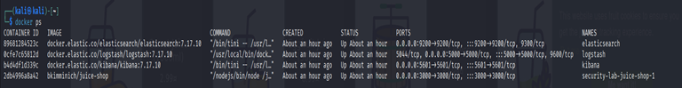

**Docker status**
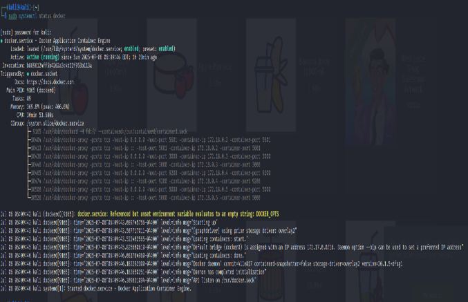

### ELK + Logstash Pipeline
**Logstash pipeline config**
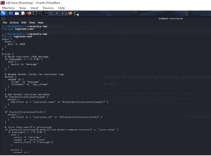
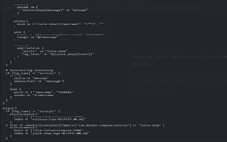
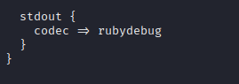

### Suricata + Filebeat Services
**Suricata service status**
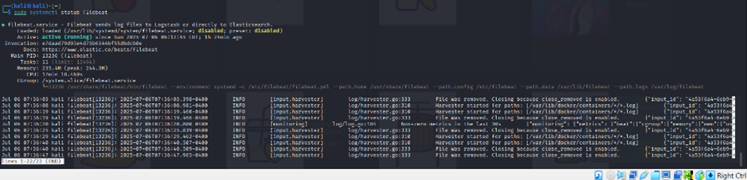

**Filebeat service status**
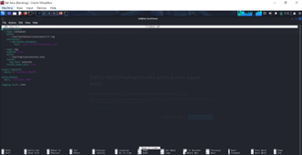


### Kibana Visualization
**Kibana showing visualized logs**
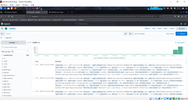

### Attack Simulation Proof
**Nmap activity**
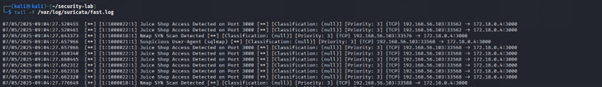

**SQL Injection activity**


**XSS activity**
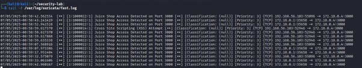

### Target Application
**OWASP Juice Shop running**
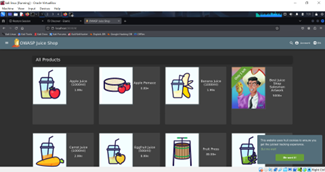

## How to run (high level)

## Setup (high level)

### 1) Start ELK (Docker)
```bash
docker compose up -d
docker ps
##start suricata

sudo systemctl start suricata
sudo systemctl status suricata --no-pager

##start filebeat
sudo systemctl start filebeat
sudo systemctl status filebeat --no-pager
